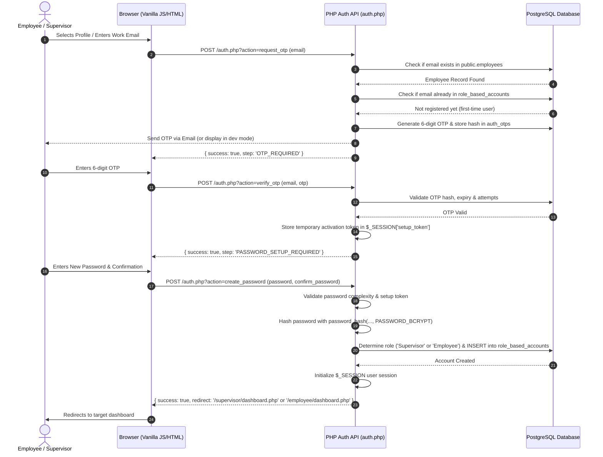
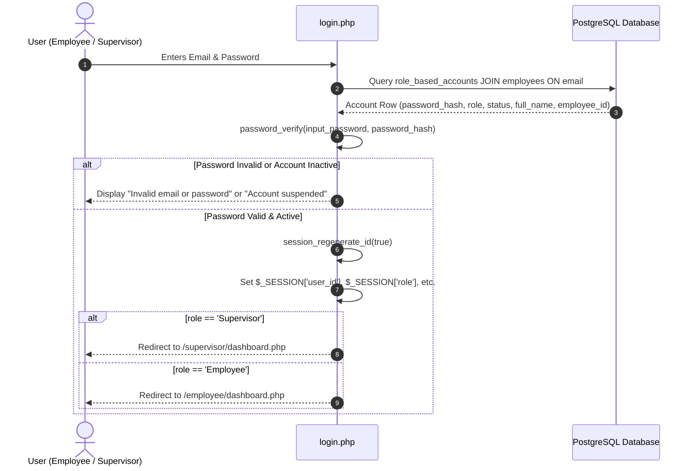

# Authentication & Login Flow Specification (Vanilla PHP + PostgreSQL)

This document provides a comprehensive analysis of the employee directory-based login flow, comparing the reference Next.js implementation with the new **Vanilla PHP & PostgreSQL** implementation. In this version, **the "Use HR Password" option has been completely removed**, enforcing that every user (Employees & Supervisors) must create their own secure password during first-time account setup.

---

## 1. System Overview & Comparison

### Previous Flow (Next.js / Supabase Reference)
1. **Employee Selection**: User selects their profile from a directory (`mock_employees`).
2. **OTP Verification**: A 6-digit OTP is dispatched to the employee's email.
3. **Password Setup Branch**:
   - *Option A*: Use pre-existing HR password (`mock_employees.password_hash`). *(Removed)*
   - *Option B*: Create a custom password.
4. **Session Management**: JWT / Supabase Auth tokens & custom database sessions.

### New Vanilla PHP Flow (Clean 2-Role System: `Employee` & `Supervisor`)
1. **Directory / Email Discovery**: User selects their name/code or enters their official email.
2. **One-Time Identity Verification (OTP)**: Verifies employee email ownership.
3. **Mandatory First-Time Password Setup**:
   - **No HR password reuse**.
   - User inputs and confirms their own password.
   - Account record is inserted into `role_based_accounts` with a strong bcrypt/argon2id hash.
4. **Regular Login**: Direct Email + Password authentication via PHP native sessions (`$_SESSION`).
5. **Role-Based Redirection**:
   - `Supervisor` &rarr; `/supervisor/dashboard.php`
   - `Employee` &rarr; `/employee/dashboard.php`

---

## 2. Database Schema

The system uses two PostgreSQL tables: `employees` (employee identity & profile data) and `role_based_accounts` (credentials & authentication status).

```sql
-- 1. Employee Directory & Profiles
CREATE TABLE public.employees (
  id CHARACTER VARYING(100) NOT NULL DEFAULT (extensions.uuid_generate_v4())::text,
  employee_code CHARACTER VARYING(50) NULL,
  full_name CHARACTER VARYING(150) NOT NULL,
  email CHARACTER VARYING(150) NULL,
  role CHARACTER VARYING(50) NULL DEFAULT 'Associate'::CHARACTER VARYING, -- Internal title/tier
  title CHARACTER VARYING(100) NULL,
  department_id CHARACTER VARYING(100) NULL,
  avatar_url TEXT NULL,
  current_level INTEGER NULL DEFAULT 1,
  total_xp INTEGER NULL DEFAULT 0,
  status CHARACTER VARYING(30) NULL DEFAULT 'Active'::CHARACTER VARYING,
  created_at TIMESTAMP WITH TIME ZONE NULL DEFAULT now(),
  updated_at TIMESTAMP WITH TIME ZONE NULL DEFAULT now(),
  CONSTRAINT employees_pkey PRIMARY KEY (id),
  CONSTRAINT employees_email_key UNIQUE (email),
  CONSTRAINT employees_employee_code_key UNIQUE (employee_code)
);

-- 2. Authentication Accounts (Role: 'Employee' or 'Supervisor')
CREATE TABLE public.role_based_accounts (
  id UUID NOT NULL DEFAULT gen_random_uuid(),
  email CHARACTER VARYING(255) NOT NULL,
  password_hash TEXT NOT NULL,
  role CHARACTER VARYING(50) NOT NULL DEFAULT 'Employee'::CHARACTER VARYING, -- 'Employee' | 'Supervisor'
  status CHARACTER VARYING(20) NOT NULL DEFAULT 'Active'::CHARACTER VARYING,
  created_at TIMESTAMP WITH TIME ZONE NULL DEFAULT now(),
  updated_at TIMESTAMP WITH TIME ZONE NULL DEFAULT now(),
  CONSTRAINT role_based_accounts_pkey PRIMARY KEY (id),
  CONSTRAINT role_based_accounts_email_key UNIQUE (email)
);

-- Indexes for optimal lookup performance
CREATE INDEX IF NOT EXISTS idx_role_based_accounts_email ON public.role_based_accounts USING btree (email);
CREATE INDEX IF NOT EXISTS idx_role_based_accounts_role ON public.role_based_accounts USING btree (role);
CREATE INDEX IF NOT EXISTS idx_role_based_accounts_status ON public.role_based_accounts USING btree (status);

-- 3. Optional: OTP Verification Table (for account setup / password resets)
create table public.otp_codes (
  id uuid not null default gen_random_uuid (),
  user_id uuid not null,
  code_hash text not null,
  expires_at timestamp with time zone not null,
  used_at timestamp with time zone null,
  created_at timestamp with time zone not null default now(),
  attempts integer null default 0,
  email character varying(255) null,
  employee_name character varying(100) null,
  constraint otp_codes_pkey primary key (id),
  constraint otp_codes_user_id_created_at_key unique (user_id, created_at)
) TABLESPACE pg_default;
```

---

## 3. Step-by-Step Flow Diagrams

### A. First-Time Setup Flow (User Creates Password)



---

### B. Regular Login Flow (Direct Email + Password)



---

## 4. Vanilla PHP Implementation Code

### 1. Database Connection (`db.php`)
```php
<?php
// config/db.php

$host = getenv('DB_HOST') ?: 'localhost';
$port = getenv('DB_PORT') ?: '5432';
$dbname = getenv('DB_NAME') ?: 'airship';
$user = getenv('DB_USER') ?: 'postgres';
$password = getenv('DB_PASS') ?: 'postgres';

try {
    $dsn = "pgsql:host=$host;port=$port;dbname=$dbname;";
    $pdo = new PDO($dsn, $user, $password, [
        PDO::ATTR_ERRMODE            => PDO::ERRMODE_EXCEPTION,
        PDO::ATTR_DEFAULT_FETCH_MODE => PDO::FETCH_ASSOC,
        PDO::ATTR_EMULATE_PREPARES   => false,
    ]);
} catch (PDOException $e) {
    http_response_code(500);
    die(json_encode(['error' => 'Database connection failed: ' . $e->getMessage()]));
}
```

---

### 2. Authentication Controller (`auth.php` / API)
```php
<?php
// api/auth.php
session_start();
header('Content-Type: application/json');
require_once __DIR__ . '/../config/db.php';

$action = $_GET['action'] ?? '';
$input = json_decode(file_get_contents('php://input'), true) ?? $_POST;

switch ($action) {
    // 1. Fetch available employees (filtered by role if needed)
    case 'get_employees':
        $role = $input['role'] ?? $_GET['role'] ?? null;
        $sql = "SELECT e.id, e.employee_code, e.full_name, e.email, e.role, e.title, e.avatar_url,
                       (rba.id IS NOT NULL) AS is_registered
                FROM public.employees e
                LEFT JOIN public.role_based_accounts rba ON e.email = rba.email
                WHERE e.status = 'Active'";
        
        $params = [];
        if ($role) {
            $sql .= " AND e.role ILIKE :role";
            $params[':role'] = "%$role%";
        }
        $sql .= " ORDER BY e.full_name ASC";

        $stmt = $pdo->prepare($sql);
        $stmt->execute($params);
        echo json_encode(['success' => true, 'employees' => $stmt->fetchAll()]);
        break;

    // 2. Request OTP for first-time account creation / setup
    case 'request_otp':
        $email = trim($input['email'] ?? '');
        if (!filter_var($email, FILTER_VALIDATE_EMAIL)) {
            echo json_encode(['success' => false, 'message' => 'Invalid email address']);
            exit;
        }

        // Check if employee exists in company directory
        $empStmt = $pdo->prepare("SELECT id, full_name, role FROM public.employees WHERE email = :email AND status = 'Active'");
        $empStmt->execute([':email' => $email]);
        $employee = $empStmt->fetch();

        if (!$employee) {
            echo json_encode(['success' => false, 'message' => 'Employee record not found or inactive.']);
            exit;
        }

        // Generate 6-digit OTP
        $otp = str_pad((string)random_int(0, 999999), 6, '0', STR_PAD_LEFT);
        $otpHash = hash('sha256', $otp);
        $expiresAt = date('Y-m-d H:i:s', time() + (10 * 60)); // 10 minutes

        // Invalidate previous OTPs
        $delStmt = $pdo->prepare("DELETE FROM public.auth_otps WHERE email = :email");
        $delStmt->execute([':email' => $email]);

        // Insert new OTP
        $insStmt = $pdo->prepare("INSERT INTO public.auth_otps (email, otp_hash, expires_at) VALUES (:email, :hash, :expires)");
        $insStmt->execute([':email' => $email, ':hash' => $otpHash, ':expires' => $expiresAt]);

        // In production: send via mail($email, "Your Verification OTP", "Your code is: $otp");
        // For development/demo purposes:
        echo json_encode([
            'success' => true,
            'message' => 'OTP sent to email.',
            'dev_otp' => $otp // Remove in production!
        ]);
        break;

    // 3. Verify OTP
    case 'verify_otp':
        $email = trim($input['email'] ?? '');
        $otp = trim($input['otp'] ?? '');
        $otpHash = hash('sha256', $otp);

        $stmt = $pdo->prepare("SELECT * FROM public.auth_otps WHERE email = :email AND used_at IS NULL ORDER BY created_at DESC LIMIT 1");
        $stmt->execute([':email' => $email]);
        $record = $stmt->fetch();

        if (!$record || strtotime($record['expires_at']) < time()) {
            echo json_encode(['success' => false, 'message' => 'OTP has expired or does not exist.']);
            exit;
        }

        if ($record['attempts'] >= 5) {
            echo json_encode(['success' => false, 'message' => 'Too many failed attempts. Please request a new OTP.']);
            exit;
        }

        if ($record['otp_hash'] !== $otpHash) {
            $pdo->prepare("UPDATE public.auth_otps SET attempts = attempts + 1 WHERE id = :id")->execute([':id' => $record['id']]);
            echo json_encode(['success' => false, 'message' => 'Invalid OTP code.']);
            exit;
        }

        // Mark OTP as used
        $pdo->prepare("UPDATE public.auth_otps SET used_at = NOW() WHERE id = :id")->execute([':id' => $record['id']]);

        // Save verification in session
        $_SESSION['setup_verified_email'] = $email;
        $_SESSION['setup_token'] = bin2hex(random_bytes(16));

        echo json_encode([
            'success' => true,
            'setup_token' => $_SESSION['setup_token'],
            'message' => 'OTP verified successfully. Please create your password.'
        ]);
        break;

    // 4. Create User Password (NO HR PASSWORD OPTION)
    case 'create_password':
        $setupToken = $input['setup_token'] ?? '';
        $password = $input['password'] ?? '';
        $confirmPassword = $input['confirm_password'] ?? '';
        $email = $_SESSION['setup_verified_email'] ?? null;

        if (!$email || empty($_SESSION['setup_token']) || $_SESSION['setup_token'] !== $setupToken) {
            echo json_encode(['success' => false, 'message' => 'Unauthorized or expired session. Please verify OTP again.']);
            exit;
        }

        if (strlen($password) < 6) {
            echo json_encode(['success' => false, 'message' => 'Password must be at least 6 characters long.']);
            exit;
        }

        if ($password !== $confirmPassword) {
            echo json_encode(['success' => false, 'message' => 'Passwords do not match.']);
            exit;
        }

        // Lookup employee profile to determine assigned system role
        $empStmt = $pdo->prepare("SELECT id, full_name, role FROM public.employees WHERE email = :email");
        $empStmt->execute([':email' => $email]);
        $employee = $empStmt->fetch();

        if (!$employee) {
            echo json_encode(['success' => false, 'message' => 'Employee profile not found.']);
            exit;
        }

        // Map employee role to system role: 'Supervisor' or 'Employee'
        $assignedRole = (stripos($employee['role'], 'Supervisor') !== false || stripos($employee['role'], 'Manager') !== false)
            ? 'Supervisor'
            : 'Employee';

        $passwordHash = password_hash($password, PASSWORD_BCRYPT, ['cost' => 12]);

        // Insert or update into role_based_accounts
        $accStmt = $pdo->prepare("
            INSERT INTO public.role_based_accounts (email, password_hash, role, status, created_at, updated_at)
            VALUES (:email, :hash, :role, 'Active', NOW(), NOW())
            ON CONFLICT (email) DO UPDATE 
            SET password_hash = EXCLUDED.password_hash,
                role = EXCLUDED.role,
                status = 'Active',
                updated_at = NOW()
            RETURNING id, email, role
        ");
        $accStmt->execute([
            ':email' => $email,
            ':hash'  => $passwordHash,
            ':role'  => $assignedRole
        ]);
        $account = $accStmt->fetch();

        // Clear temporary setup tokens
        unset($_SESSION['setup_verified_email'], $_SESSION['setup_token']);

        // Establish authenticated session
        session_regenerate_id(true);
        $_SESSION['user_id'] = $account['id'];
        $_SESSION['employee_id'] = $employee['id'];
        $_SESSION['email'] = $account['email'];
        $_SESSION['full_name'] = $employee['full_name'];
        $_SESSION['role'] = $account['role'];

        $redirectUrl = ($account['role'] === 'Supervisor') ? '/supervisor/dashboard.php' : '/employee/dashboard.php';

        echo json_encode([
            'success' => true,
            'message' => 'Password created successfully!',
            'role' => $account['role'],
            'redirect' => $redirectUrl
        ]);
        break;

    // 5. Standard Login (Email + Password)
    case 'login':
        $email = trim($input['email'] ?? '');
        $password = $input['password'] ?? '';

        if (empty($email) || empty($password)) {
            echo json_encode(['success' => false, 'message' => 'Please provide both email and password.']);
            exit;
        }

        // Fetch account
        $stmt = $pdo->prepare("
            SELECT rba.id AS account_id, rba.email, rba.password_hash, rba.role, rba.status,
                   e.id AS employee_id, e.full_name
            FROM public.role_based_accounts rba
            LEFT JOIN public.employees e ON rba.email = e.email
            WHERE rba.email = :email
        ");
        $stmt->execute([':email' => $email]);
        $user = $stmt->fetch();

        if (!$user || !password_verify($password, $user['password_hash'])) {
            echo json_encode(['success' => false, 'message' => 'Invalid email or password.']);
            exit;
        }

        if ($user['status'] !== 'Active') {
            echo json_encode(['success' => false, 'message' => 'Your account is suspended or inactive.']);
            exit;
        }

        // Regenerate session ID to prevent fixation
        session_regenerate_id(true);
        $_SESSION['user_id']     = $user['account_id'];
        $_SESSION['employee_id'] = $user['employee_id'];
        $_SESSION['email']       = $user['email'];
        $_SESSION['full_name']   = $user['full_name'] ?? 'User';
        $_SESSION['role']        = $user['role']; // 'Supervisor' or 'Employee'

        $redirectUrl = ($user['role'] === 'Supervisor') ? '/supervisor/dashboard.php' : '/employee/dashboard.php';

        echo json_encode([
            'success'  => true,
            'role'     => $user['role'],
            'redirect' => $redirectUrl
        ]);
        break;

    // 6. Logout
    case 'logout':
        $_SESSION = [];
        if (ini_get("session.use_cookies")) {
            $params = session_get_cookie_params();
            setcookie(session_name(), '', time() - 42000,
                $params["path"], $params["domain"],
                $params["secure"], $params["httponly"]
            );
        }
        session_destroy();
        echo json_encode(['success' => true, 'redirect' => '/login.php']);
        break;

    default:
        echo json_encode(['success' => false, 'message' => 'Invalid action.']);
        break;
}
```

---

### 3. Role-Based Session Guard Helper (`auth_check.php`)
Include this at the top of protected pages:

```php
<?php
// includes/auth_check.php
if (session_status() === PHP_SESSION_NONE) {
    session_start();
}

function requireRole($allowedRoles = []) {
    if (empty($_SESSION['user_id']) || empty($_SESSION['role'])) {
        header('Location: /login.php');
        exit;
    }

    if (!is_array($allowedRoles)) {
        $allowedRoles = [$allowedRoles];
    }

    if (!in_array($_SESSION['role'], $allowedRoles, true)) {
        http_response_code(403);
        echo "<h1>403 Forbidden</h1><p>You do not have permission to access this page.</p>";
        exit;
    }
}
```

**Usage Example in `supervisor/dashboard.php`:**
```php
<?php
require_once __DIR__ . '/../includes/auth_check.php';
requireRole('Supervisor'); // Only supervisors allowed
?>
<!DOCTYPE html>
<html>
<head><title>Supervisor Dashboard</title></head>
<body>
    <h1>Welcome, Supervisor <?= htmlspecialchars($_SESSION['full_name']) ?>!</h1>
    <a href="/api/auth.php?action=logout">Log Out</a>
</body>
</html>
```

**Usage Example in `employee/dashboard.php`:**
```php
<?php
require_once __DIR__ . '/../includes/auth_check.php';
requireRole(['Employee', 'Supervisor']); // Employees & Supervisors allowed
?>
<!DOCTYPE html>
<html>
<head><title>Employee Dashboard</title></head>
<body>
    <h1>Welcome, <?= htmlspecialchars($_SESSION['full_name']) ?>!</h1>
    <a href="/api/auth.php?action=logout">Log Out</a>
</body>
</html>
```

---

## 5. Summary of Key Adjustments

| Feature | Old Next.js / Supabase Implementation | New Vanilla PHP + PostgreSQL Implementation |
| :--- | :--- | :--- |
| **Password Source** | Allowed using pre-existing HR password hash (`mock_employees.password_hash`) or creating a new one. | **Removed HR password entirely**. Every user must create their own password during onboarding. |
| **Roles Supported** | Multiple roles (`Admin`, `Manager`, `Operator`, `Executive`, `Employee`). | Simplified to 2 roles: **`Employee`** and **`Supervisor`**. |
| **Authentication Engine**| Supabase GoTrue Auth API + Custom Sessions table. | Native PHP sessions (`$_SESSION`) + `password_hash()` / `password_verify()` with `public.role_based_accounts`. |
| **Identity Verification**| OTP verified via Next.js API route to Supabase table. | Direct verification via PDO against `public.auth_otps` table. |
| **Access Control** | Middleware & Client-side session guards. | Server-side role guard function (`requireRole()`). |
